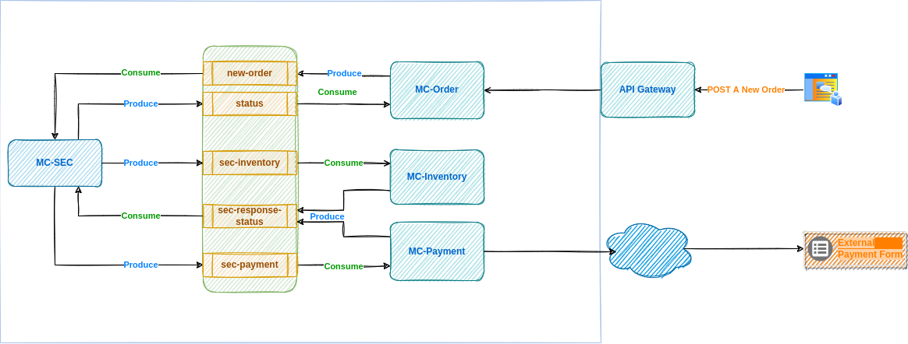

# Saga Orchestration
## Reference
* [Saga](https://microservices.io/patterns/data/saga.html)



## Microservices

- [Orders](https://github.com/andrelsf/mc-orders.git)
- [Saga Exection Coordinator](https://github.com/andrelsf/mc-sec.git)
- [Inventory](https://github.com/andrelsf/mc-inventory.git)
- [Payments](https://github.com/andrelsf/mc-payments.git)
- [Library](https://github.com/andrelsf/mc-lib.git)

### With
- Quarkus
- Java 11
- Liquibase Database Migrations
- PostgreSQL
- Jeager
- Kafka
- Docker
- Docker Compose
- HTTPie

`NOTES`: 
- import as module IntelliJ IDEA
- `library` run command directory root (Install library local)
```
mvn clean install package
mvn install:install-file \
    -Dfile=target/mc-lib-1.0.0.jar \
    -DgroupId=br.dev.multicode \
    -DartifactId=mc-lib \
    -Dversion=1.0.0 \
    -Dpackaging=jar
```

Run by CLI:
```
mvn compile quarkus:dev
```

## Requirements
- Java 11+
- Maven
- Docker
- Docker Compose
- IDE or CLI to execute quarkus
- HTTPie or cURL (Optional)

Request using HTTPie
```shell
http --json POST :8090/api/orders < mc-order/payloads/postANewOrder.json
```

## Jeager

- [Jeager](http://localhost:16686/search)

